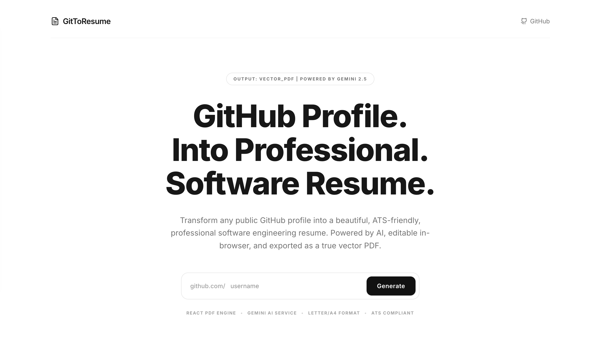

# GitToResume

GitToResume is an AI-powered web application that transforms any public GitHub profile into a beautiful, ATS-friendly, professional resume. 

The application fetches public GitHub profile data, repositories, and README content, uses Google Gemini 2.5 Flash to generate a truthful resume JSON structure, allows editing every field directly in the browser, and exports the final resume as a true vector PDF using WeasyPrint.



## Project Structure

```
gitToResume/
├── backend/            # FastAPI Backend
│   ├── services/       # GitHub, AI, and PDF Services
│   ├── templates/      # Jinja2 HTML/CSS templates for PDF compilation
│   ├── main.py         # FastAPI main application
│   ├── requirements.txt
│   └── .env            # Environment variables (Gemini key, GitHub token)
├── frontend/           # React + Vite Frontend (TypeScript + TailwindCSS v4)
│   ├── src/
│   │   ├── store/      # Zustand store for state management
│   │   ├── types/      # TypeScript interfaces
│   │   ├── App.tsx     # Welcome UI & Interactive Resume Editor
│   │   ├── index.css   # Stylesheets with Tailwind import
│   │   └── main.tsx
│   ├── tsconfig.json
│   └── package.json
└── README.md           # Documentation
```

---

## Getting Started

### 1. Backend Setup

Prerequisites: Python 3.13+ and system dependencies for PDF rendering.

#### System Dependencies (for PDF compilation)
WeasyPrint requires Cairo, Pango, and GDK-Pixbuf. Install them via Homebrew on macOS:
```bash
brew install cairo pango gdk-pixbuf libffi
```

#### Python Environment
1. Navigate to the backend folder:
   ```bash
   cd backend
   ```
2. Create and activate a virtual environment:
   ```bash
   python3 -m venv .venv
   source .venv/bin/activate
   ```
3. Install Python requirements:
   ```bash
   pip install -r requirements.txt
   ```
4. Copy the environment variables example and configure your keys:
   ```bash
   cp .env.example .env
   ```
   Open `.env` and fill in:
   - `GEMINI_API_KEY`: Get a free key from Google AI Studio.
   - `GITHUB_TOKEN`: (Optional) Highly recommended to avoid GitHub API rate limits.

5. Start the backend development server:
   ```bash
   python main.py
   ```
   The backend will run on [http://localhost:8000](http://localhost:8000).

---

### 2. Frontend Setup

Prerequisites: Node.js and `pnpm` (or `npm`).

1. Navigate to the frontend folder:
   ```bash
   cd frontend
   ```
2. Install dependencies:
   ```bash
   pnpm install
   ```
3. Start the Vite development server:
   ```bash
   pnpm run dev
   ```
   The web application will run on [http://localhost:5173](http://localhost:5173).

---

## Key Features

1. **GitHub Analysis**: Scans public repositories, pinned repositories, languages, and processes README documentation to extract technical competencies.
2. **AI Resume Drafting**: Google Gemini 2.5 Flash compiles GitHub info into an ATS-friendly draft, leaving missing sections (like Work Experience) blank for the user rather than fabricating details.
3. **In-Browser Inline Editor**: Click and edit any text directly on the resume A4 canvas (like Google Docs or Notion). Add new jobs, education, certifications, and skills via the sidebar.
4. **Vector PDF Export**: Sends the modified resume JSON back to the backend, rendering it through a Jinja2 template styled with print dimensions, and builds a vector PDF with fully selectable and searchable text.
