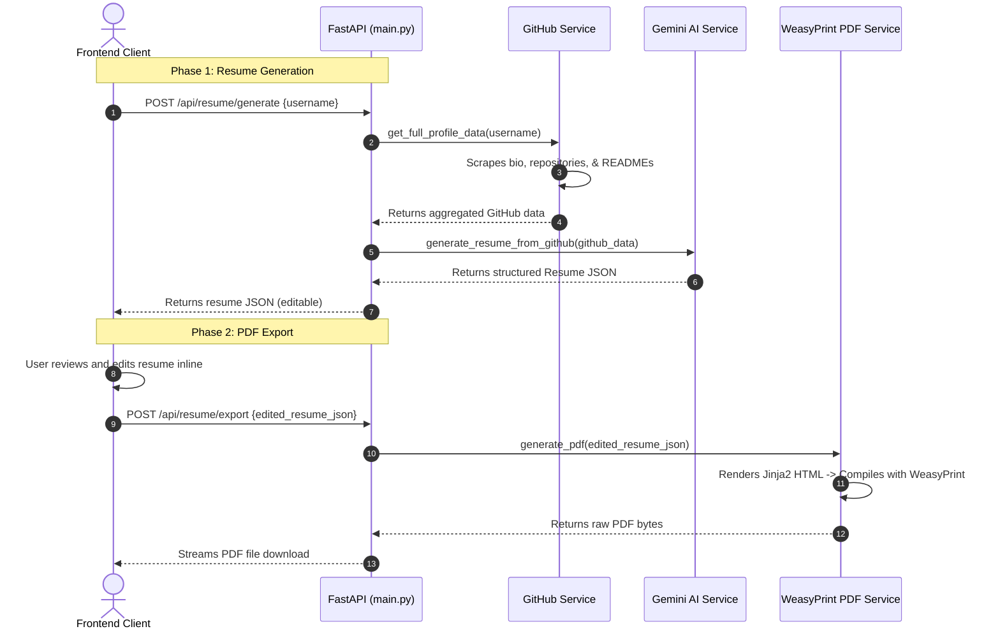

# GitToResume Backend Explanation

This document explains the architecture, files, library usages, and data flows of the GitToResume FastAPI backend.

---

## 1. Architecture Overview

The backend is built as a modular, service-oriented Python web application using **FastAPI**. It has been designed with separate layers for API handling and core domain logic (GitHub data fetching, Gemini AI processing, and PDF compiling).

```
backend/
├── services/
│   ├── github.py       # Scrapes public GitHub user info
│   ├── ai.py           # Uses Gemini 2.5 Flash to synthesize data
│   └── pdf.py          # Formats and builds vector PDF
├── templates/
│   └── resume.html     # HTML/CSS blueprint for the PDF
├── main.py             # FastAPI entry point & API endpoints
├── requirements.txt    # Library list
└── .env                # Local secrets (API keys)
```

---

## 2. File-by-File Breakdown

### 📂 [backend/main.py](file:///Users/supreme/Dev/gitToResume/backend/main.py)
*   **Purpose**: The entry point for the backend. It handles server configuration, API routing, CORS initialization, request/response validation, and exception management.
*   **Key Logic**:
    *   Exposes `GET /` for backend health checks.
    *   Exposes `POST /api/resume/generate` which accepts a GitHub username and triggers the sequential scraping and AI synthesis, returning a verified resume JSON payload.
    *   Exposes `POST /api/resume/export` which accepts the edited resume JSON payload and streams the compiled PDF binary back for client download.
    *   Uses **Pydantic** models (`ResumeModel`, `ProjectModel`, etc.) to enforce strict typing on request bodies.

### 📂 [backend/services/github.py](file:///Users/supreme/Dev/gitToResume/backend/services/github.py)
*   **Purpose**: Aggregates raw public data from the GitHub REST API.
*   **Key Logic**:
    *   Fetches the main user profile (Bio, Company, Location, Blog).
    *   Queries up to 100 repositories, sorted by stars to find top projects.
    *   Loads the user's special profile README (`username/username`) as it usually contains self-written resumes, bios, and links.
    *   Fetches the README contents of the top 5 repositories. It cleans and truncates them (max 10,000 chars per README) to avoid overloading the AI model's context window.

### 📂 [backend/services/ai.py](file:///Users/supreme/Dev/gitToResume/backend/services/ai.py)
*   **Purpose**: Interfaces with the Gemini 2.5 Flash API to analyze the GitHub profile and draft a technical resume.
*   **Key Logic**:
    *   Constructs a highly structured system prompt enforcing **truthfulness** (no fabrication of work history or degrees).
    *   Queries the Gemini API using **Structured JSON Outputs**. It defines a strict JSON Schema representing the resume. Gemini is forced to match this schema, preventing raw text or markdown responses.

### 📂 [backend/services/pdf.py](file:///Users/supreme/Dev/gitToResume/backend/services/pdf.py)
*   **Purpose**: Converts the resume data into a true vector PDF file.
*   **Key Logic**:
    *   Loads the Jinja2 HTML template and passes the resume dictionary to it.
    *   Uses **WeasyPrint** to render the HTML structure and compile it directly into a PDF binary stream.

### 📂 [backend/templates/resume.html](file:///Users/supreme/Dev/gitToResume/backend/templates/resume.html)
*   **Purpose**: Defines the layout, fonts, margins, and typography of the compiled PDF.
*   **Key Logic**:
    *   Utilizes CSS print media queries (`@page`) to configure standard Letter sizing, page margins, and automatic page numbers.
    *   Uses logical, semantic HTML structures (header, sections, bullet points) so the generated PDF is fully readable by Applicant Tracking Systems (ATS) and has selectable text.

---

## 3. Libraries Used and Why

| Library | Version | Purpose | Why We Used It |
| :--- | :--- | :--- | :--- |
| **FastAPI** | `>=0.110.0` | Web framework | Extremely fast, built-in async support, automatic OpenAPI/Swagger docs generation, and robust CORS integration. |
| **Uvicorn** | `>=0.28.0` | ASGI Web Server | The standard, high-performance web server for running FastAPI apps in Python. |
| **Pydantic** | `>=2.6.0` | Data Validation | Performs strict typing validation on incoming and outgoing JSON data to guarantee schema compliance. |
| **HTTPX** | `>=0.27.0` | HTTP Client | Asynchronous HTTP client for fetching data from GitHub and Gemini APIs without blocking the main server threads. |
| **WeasyPrint** | `>=61.0` | PDF Compiler | Compiles HTML/CSS templates into high-quality vector PDFs (not images). Under the hood, it uses **Cairo** and **Pango** to guarantee sharp vector fonts at any zoom level. |
| **Jinja2** | `>=3.1.0` | HTML Templating | Allows injecting dynamic Python dictionary data safely into the HTML file structure before compiling. |
| **python-dotenv**| `>=1.0.1` | Env loader | Loads key secrets (like `GEMINI_API_KEY`) from local `.env` files into environment variables. |

---

## 4. End-to-End Data Flow


